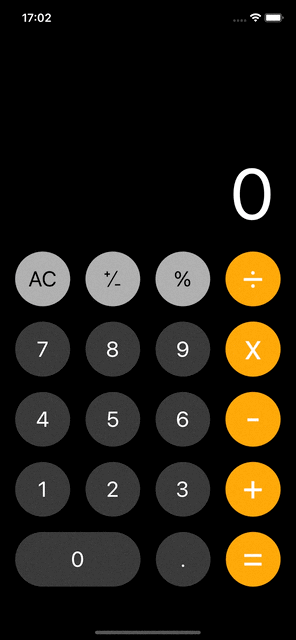

# Calculator App

<div align="center">
  
</div>


Calculator with a professional design, customizable and with several functions using object orientation and clean code.


<p align="center">
  
 </p>
 
 ## Technologies used 🛠️ 

- UIKit
- Storyboard
- Auto Layout
- Layered Architecture
- OOP
- Unit Testing
- Clean Code
 
 
 
 
 ## Clone the repository 🔧

```shell
git clone https://github.com/henriquezani/Calculator-swift-ios.git
```
